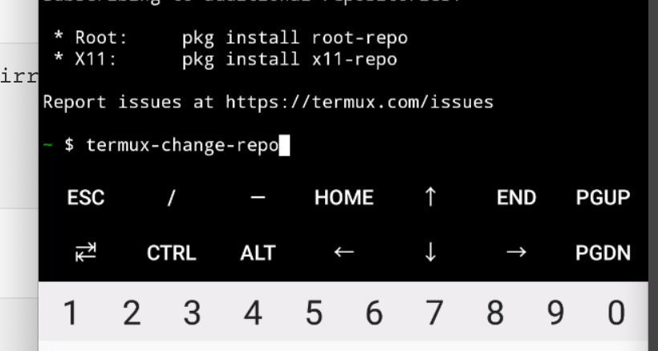
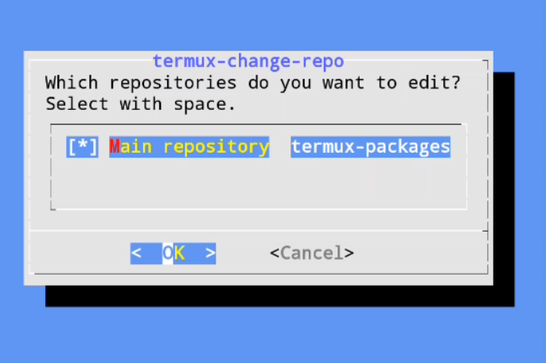
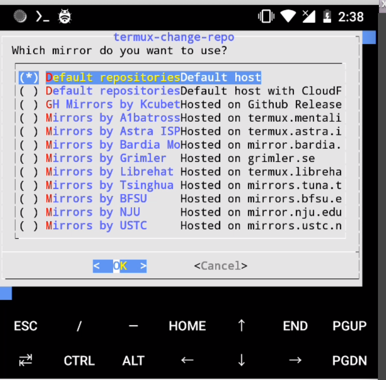
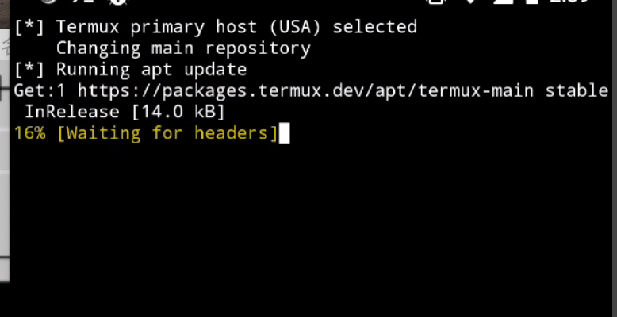
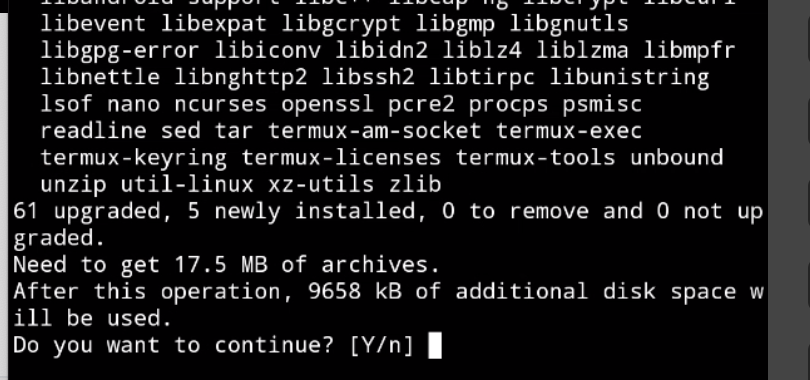
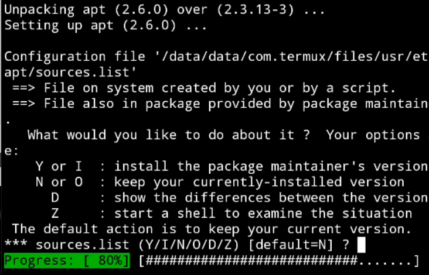
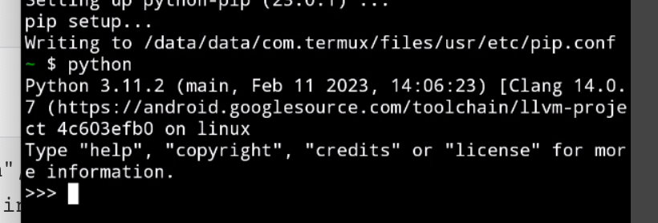
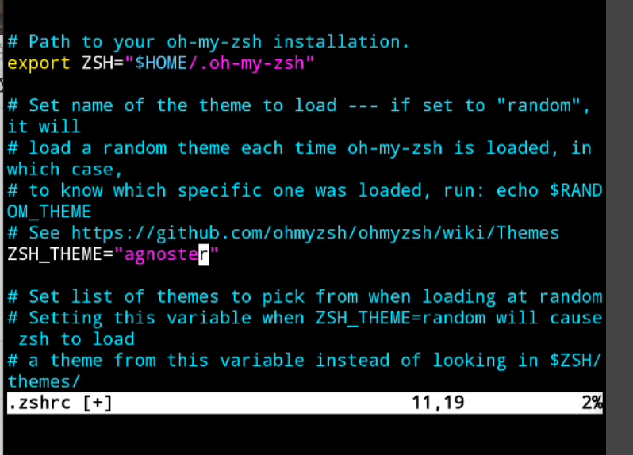
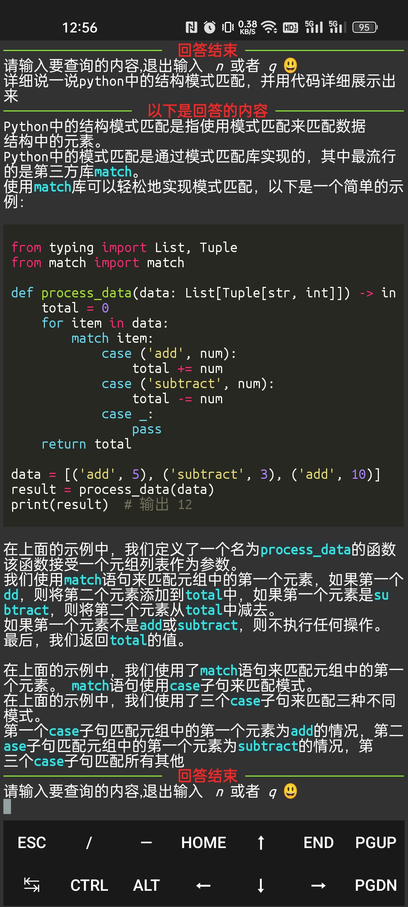
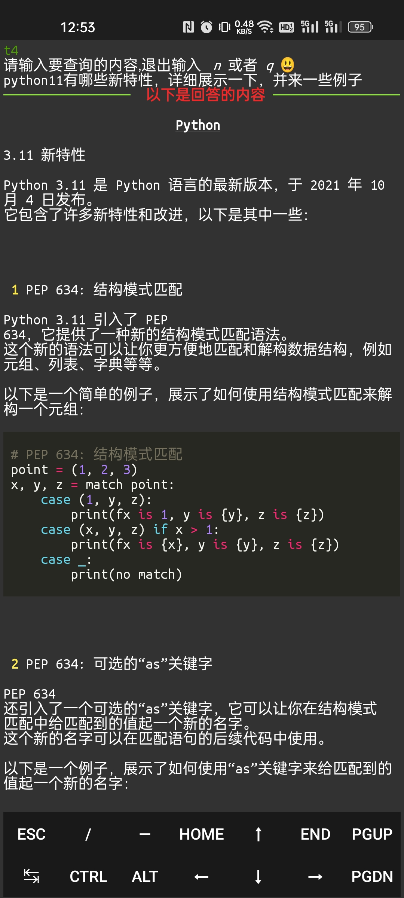

以下是如何在Termux上设置Oh My Zsh以及运行Python程序的步骤：

### 简介

```
Android 和 Linux 的内核结构本来是
Termux 是一个 Android 下一个高级的终端模拟器，开源且不需要 root，支持 apt 管理软件包，十分方便安装软件包，完美支持 Python、 PHP、 Ruby、 Nodejs、 MySQL 等。
```

### 1. 安装Termux

如果您还没有安装Termux，请前往Google Play Store或F-Droid下载并安装它。

我给传到网盘了：链接:https://pan.baidu.com/s/1y4hkmHFjLg1VLRqm8MoLrw?pwd=6666
提取码:6666

### 基本使用

操作

```
长按屏幕
COPY:复制
PASTE:粘贴
More:更多
   ├── Select URL:             # 提取屏幕所有网址
   └── Share transcipt:        # 分享命令脚本
   └── Reset:                  # 重置
   └── Kill process:           # 杀掉当前会话进程
   └── Style:                  # 风格配色 需要自行安装
   └── Keep screen on:         # 保持屏幕常亮
   └── Help:                   # 帮助文档
```

#### 

#### 更新源

最新的termux，可以通过命令修改源为国内的源加快下载速度,

```
termux-change-repo
```



之后会出现选择界面



按键盘手机的回车键，点击确认即可进入修改源的页面。



点击屏幕的箭头键按下即可进行选择，找到“Mirrors byTsinghua”这个清华镜像源，然后回车键选择OK即可。



之后就是一系列更新源的操作了等待完成即可。

> 怎么输入命令方便呢，目前比较省事的方式就是，电脑通过adb链接手机
>
> 然后使用`adb shell`，进入到手机命令行中，之后执行
>
> `input text "termux-change-repo"`即可。

### 2. 安装必要的软件包

打开Termux应用程序并输入以下命令：

```
pkg update
```

这将更新软件包并安装vim curl wget git tree python。执行pkg update的过程中，会出现类型的对话，进度会停止，执行回车键即可



以及下面这种需要回车多次



之后我们就可以执行下面的命令进行常用模块的安装:

```shell
pkg install vim curl wget git tree python zsh -y
```


一路成功安装完之后，测试每个命令是否安装成功，比如我这里执行python.可以看到当前的python版本号

### 

### 3. 安装Oh My Zsh

输入以下命令以在Termux上安装Oh My Zsh：

```
sh -c "$(curl -fsSL https://raw.github.com/ohmyzsh/ohmyzsh/master/tools/install.sh)"
```

这将下载并安装Oh My Zsh。

### 4. 配置.zshrc文件

打开您的文本编辑器（例如vim）并打开.zshrc文件：

```
vim ~/.zshrc
```

> vim小贴士:
>
> 输入i进入编辑模式。
>
> esc退出编辑模式。
>
> :set paste：进入粘贴板模式，该模式可以防止复制的文字错位。
>
> :wq：保存修改的内容
>
> :q!：不保存修改的内容


找到以下行：

```
# Set name of the theme to load --- if set to "random", it will
# load a random theme each time oh-my-zsh is loaded, in which case,
# to know which specific one was loaded, run: echo $RANDOM_THEME
ZSH_THEME="robbyrussell"
```

将主题更改为您喜欢的主题。例如，如果您想使用“agnoster”主题，请将其更改为：

```
ZSH_THEME="agnoster"
```

如下图



之后我们输入`:wq`保存修改的内容

然后执行下面的命令进行编译，让其生效

```shell
source ~/.zshrc
```


### 5. 运行Python程序

要运行Python程序，请打开Termux并输入以下命令：

cd进入程序的路径下面默认路径在这里`/data/data/com.termux/files/home`即可。

gpt.py的路径要对

```
python gpt.py
```

为了防止过多人滥用我没有将项目公开,`gpt.py`的获取方式添加微信:italocxa获取。

效果展示



